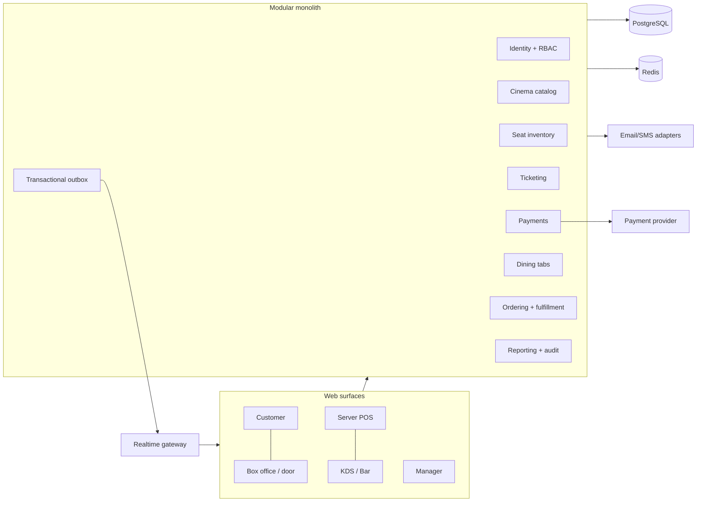

# Architecture

## Decision
Use a TypeScript modular monolith with Next.js/React surfaces, a structured server application, PostgreSQL, Drizzle migrations, Redis for acceleration, and adapter interfaces for Stripe, messaging and object storage. One deployable system minimizes early operational failure modes; domain boundaries permit later extraction only where evidence warrants it.



## Boundaries
- Cinema Catalog owns locations, auditoriums, layouts, movies and showtimes.
- Seat Inventory alone changes hold/sold/block state.
- Ticketing owns orders, tickets and admissions; it calls Inventory and Payments.
- Payments owns provider customers, method references, intents, attempts, refunds and webhooks.
- Restaurant owns tabs, orders and tab allocation; Fulfillment owns routed work.
- Identity authorizes every staff command server-side. Audit subscribes to domain facts and critical command results.

## Consistency and events
Database transactions protect invariants. Cross-module side effects use a transactional outbox with idempotent consumers. SSE is sufficient initially for seat, menu, tab and fulfillment updates; clients always re-fetch authoritative state after reconnect. Redis can cache and wake expiry work, but it cannot award a seat or declare a payment successful.

## Repository
```text
apps/{customer-web,staff-pos,kds,admin,api}
packages/{database,domain,auth,payments,events,ui,observability,testkit}
docs/   infra/   tests/{integration,e2e,load}
```
Keep this logical structure in one workspace; do not create independently deployed services during the first vertical slice.
