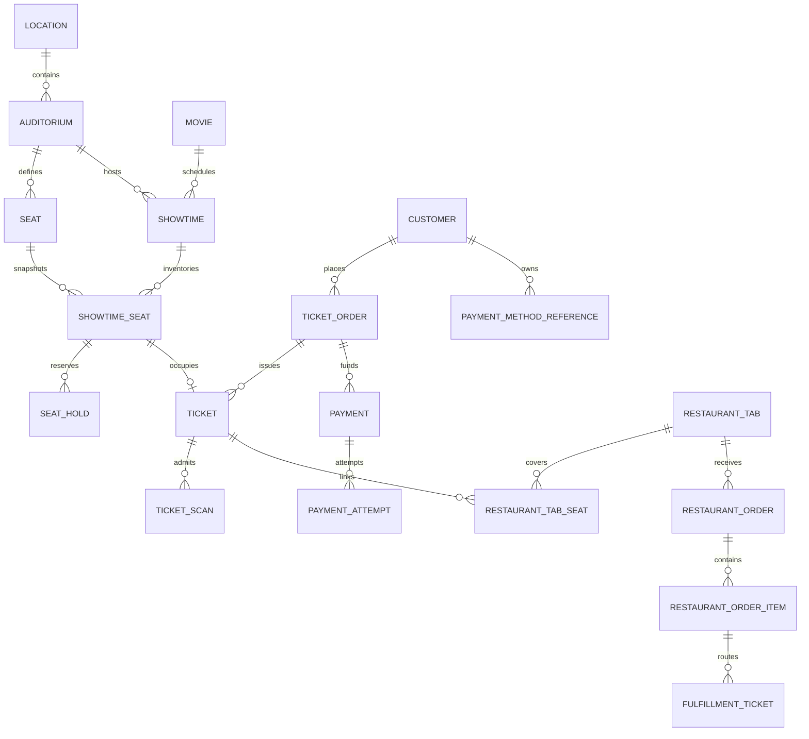

# Data Model

## Core choices
PostgreSQL is authoritative. Monetary values are integer minor units plus currency. Provider tokens are opaque references. Mutable operational records carry versions for optimistic checks; financial attempts and audit events are append-oriented. `ShowtimeSeat` snapshots layout/price attributes so later auditorium edits cannot rewrite history.

The initial `SeatMapVersion` configurations represent Theater 1 (96 seats), Theater 2 (60) and Theater 3 (32). Every seat stores row/number, plan coordinates, service-row/table grouping, seat type, price tier, ADA/companion flags and active status. Screen, aisle, entrance and service-zone geometry belong to the versioned seat map rather than the individual showtime.

## Required invariants
- Unique `(showtime_id, seat_id)` on `ShowtimeSeat`; at most one active/sold claim enforced transactionally.
- A ticket references one immutable showtime-seat; a void/refund changes state, never deletes history.
- `RestaurantTabSeat` is effective-dated so transfers remain explainable.
- A provider event ID and each business idempotency key are unique.
- Consent stores actor, timestamp, terms version, scope, ticket order and payment-method reference.
- Audit records exclude PAN, CVV, secrets and full provider payloads.

## Supporting entities
Organization, SeatMapVersion, TicketType, CustomerConsent, Membership, Refund, Menu/Category/Item/Modifier, KitchenStation, Employee/Role/Permission, Shift/CashDrawer, TaxRule, ServiceChargeRule, Promotion, Notification and AuditEvent. Gift cards are deferred pending a stored-value compliance design.
